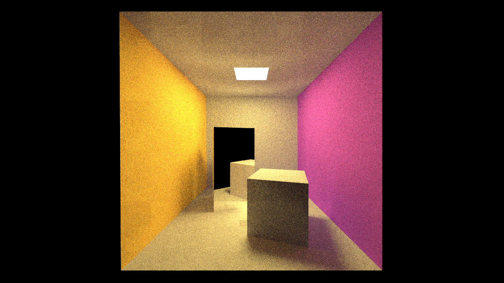

# Vulkan PathTracer
Cornell Cube PathTracer written in Vulkan.

## Building
### Prerequisites
- [Vulkan SDK](https://www.khronos.org/vulkan/download/)
- [Git](https://git-scm.com/)
- [CMake 3.16+](https://cmake.org/)
- [Ninja](https://ninja-build.org/)
### Linux
    git clone https://github.com/JDreessen/PathTracer
    cd PathTracer
    git submodule update --init --recursive
    curl https://raw.githubusercontent.com/tinyobjloader/tinyobjloader/master/tiny_obj_loader.h -o lib/tinyobjloader/tiny_obj_loader.h
    cmake -G Ninja -S . -B release -DCMAKE_BUILD_TYPE=Release
    ninja -C release
    ./compileShaders.sh
### Windows
Download and extract the latest [glslang release](https://github.com/KhronosGroup/glslang/releases/download/master-tot/glslang-master-linux-Release.zip) for Windows into `lib\glslang` before compiling shaders.

    git clone https://github.com/JDreessen/PathTracer
    dir PathTracer
    git submodule update --init --recursive
    curl https://raw.githubusercontent.com/tinyobjloader/tinyobjloader/master/tiny_obj_loader.h -o lib/tinyobjloader/tiny_obj_loader.h
    cmake -G Ninja -S . -B release -DCMAKE_BUILD_TYPE=Release
    ninja -C release
    .\compileShaders.bat
Note: Shaders have to be recompiled after modifying the shader files.
## Key Bindings
- `ESC`: Quit program
- `WASDQE`: Camera Movement
- `P`: Take screenshot

## Resources
- Vulkan Tutorial: https://vulkan-tutorial.com/
- Vulkan Raytracing Tutorials: https://iorange.github.io/
- https://www.khronos.org/blog/ray-tracing-in-vulkan